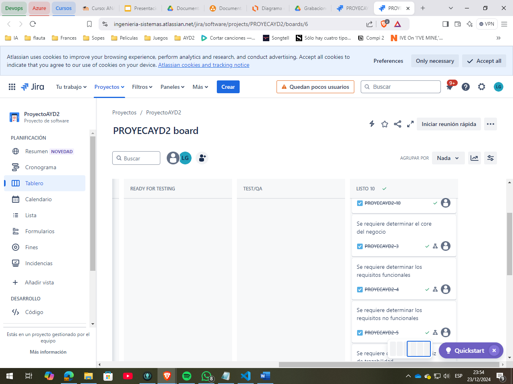

## Link grabaciones
https://drive.google.com/drive/u/1/folders/1c9sxIzYM-cdVe3ueyDJ3eQL_XqenHjHE

### Sprint Daily Scrum Report Mariano Camposeco
#### *Día 1: Modelado de Base de Datos*- Se analizó y modeló la base de datos considerando todas las posibilidades y requisitos del sistema.
- Se definieron las relaciones, entidades y atributos necesarios para garantizar escalabilidad y eficiencia en las operaciones.
##### *Complicaciones:*- Identificación de relaciones complejas que requirieron ajustes iterativos en el modelo.
- Necesidad de consenso entre el equipo para definir los nombres de tablas y columnas clave.
#### *Día 2: Implementación del Login*- Se desarrolló y probó el sistema de login para todos los usuarios.
- Aseguró la autenticación y autorización de manera segura mediante pruebas unitarias.
##### *Complicaciones:*- Manejo de diferentes escenarios de error, como contraseñas incorrectas y usuarios inactivos.
- Ajustes en la integración con el sistema de roles y permisos.
#### *Día 3: Funcionalidades de Servicios*- Se implementaron las siguientes funcionalidades:
  - Pago de servicios.  - Búsqueda de CUI.
  - Actualización de datos de clientes.  - Asignación de roles y endpoints necesarios.
- Se verificó la correcta interacción entre las funcionalidades y la base de datos.
##### *Complicaciones:*- Asegurar la consistencia de los datos en las actualizaciones concurrentes.
- Documentación de los endpoints para el equipo de frontend.
#### Día 4: Despliegue en la Nube**- Se configuraron instancias de **AWS EC2 para el entorno productivo.
- Se utilizó Docker para la contenedorización y despliegue continuo.- Aseguró la estabilidad del sistema tras el despliegue.
##### Complicaciones:
- Configuración inicial de las políticas de seguridad en AWS.- Ajustes en las imágenes Docker para reducir el tiempo de despliegue.
#### Día 5: Desarrollo del Frontend
- Se trabajaron las interfaces de usuario para las funcionalidades de:  - Pago de servicios.
  - Pago de préstamos.  - Retiro y depósito de dinero.
  - Cambio de moneda.- Se optimizó la experiencia del usuario para facilitar la navegación y uso del sistema.
##### Complicaciones:
- Compatibilidad de estilos entre navegadores.- Sincronización de cambios en backend y frontend para pruebas integrales.

---------------------------------------------------------------------

Sprint Daily Scrum Report David Enrique 
 
#### Día 1: Base del Nuevo Frontend en Angular 
- Se revisó toda la estructura base del nuevo frontend utilizando Angular. 
- Se establecieron los componentes iniciales y la arquitectura del proyecto. 
- Configuración de herramientas como Angular CLI y las dependencias principales para el desarrollo. 
 
##### Complicaciones: 
- Integración de nuevas librerías que requerían ajustes en el entorno de desarrollo. 
- Problemas iniciales con la configuración del enrutador de Angular. 
 
#### Día 2: Implementación del Login 
- Desarrollo del sistema de login para empleados, administradores y supervisores. 
- Se trabajó en la autenticación con diferentes niveles de permisos. 
- Pruebas de roles para validar accesos según las credenciales ingresadas. 
 
##### Complicaciones: 
- Ajustes en la gestión de tokens para cada tipo de usuario. 
- Sincronización entre backend y frontend para garantizar sesiones activas correctamente. 
 
#### Día 3: Funcionalidades de Servicios Bancarios 
- Implementación del frontend para: 
  - Pago de tarjetas de crédito. 
  - Registro de quejas por parte de los clientes. 
  - Gestión de inventarios bancarios. 
- Creación de formularios interactivos y validación de datos en tiempo real. 
 
##### Complicaciones: 
- Manejo de grandes volúmenes de datos para inventarios bancarios. 
- Diseño de interfaces responsivas para los formularios. 
 
#### Día 4: Funcionalidades de Monitoreo y Gestión 
- Desarrollo de: 
  - Monitoreo de actividad en tiempo real para el sistema. 
  - Registro y gestión de administradores del sistema. 
  - Visualización del historial de quejas registradas por los clientes. 
- Mejoras en la experiencia de usuario para simplificar el monitoreo. 
 
##### Complicaciones: 
- Optimización del monitoreo en tiempo real para evitar retrasos. 
- Gestión eficiente de grandes cantidades de registros históricos de quejas. 
 
#### Día 5: Gestión de Seguridad y Actualización de Datos 
- Desarrollo de funcionalidades de: 
  - Gestión y programación de copias de seguridad. 
  - Asignación y gestión de roles en el sistema. 
  - Actualización de datos de clientes desde el frontend. 
- Implementación de mensajes de confirmación y validación en los formularios. 
 
##### Complicaciones: 
- Configuración inicial de la automatización de las copias de seguridad. 
- Sincronización de roles y datos de clientes con el backend.

--------------------------------------------------------------------

Sprint Daily Scrum Report Luis Garcia 
 
#### Día 1: Funcionalidad retirar dinero - Backend
- Se analizo los datos que se recibirian

- Se realizaron las peticiones al backend

 
##### Complicaciones: 
- Nuevos requerimientos para retirar dinero
 
#### Día 2: Implementacio de funcion crear empleado
- Analizar datos que se recibirian
- crear metodos para subir informacion al S3
 
##### Complicaciones: 
- Implementar S3
 
#### Día 3: Funcionalidades de backend
- Implementacion de depositos
- Implementacion de cambio de moneda
 

--------------------------------------------------------------------

Sprint Daily Scrum Report Cristofher Saquilmer 
 
#### Día 1: Implementación Mostrar Saldo y Creción de Cuenta Monetario o Ahorro 
- Se revisó la estructura para el modulo de mostrar saldo. 
- Se revisó la estructura para el modulo de crear cuenta Monetario o Ahorro.
 
##### Complicaciones: 
- Terceros: Salida demasiado tarde del Trabajo.
- Envío de fotografía al backend
 
#### Día 2: Implementación Permitir cuentas en dolares y Registro de Quejas
- Se revisó la estructura para el modulo de permitir cuentas en dolares. 
- Se revisó la estructura para el modulo de registro de quejas.
 
##### Complicaciones: 
- Terceros: Salida demasiado tarde del Trabajo.
 
#### Día 3: Implementación Encuestas de Satisfacción
- Se revisó la estructura para el modulo encuestas de satisfacción. 
 
##### Complicaciones: 
- Terceros: Salida demasiado tarde del Trabajo.
- Envío de respuestas al backend.
 
#### Día 4: Implementación Encuestas de Satisfacción Modulo Supervisor
- Se revisó la estructura para el modulo encuestas de satisfacción.  
 
##### Complicaciones: 
- Terceros: Salida demasiado tarde del Trabajo.
 
#### Día 5: Implementación Información de los Administradores 
- Se revisó la estructura para el modulo información de los administradores.
 
##### Complicaciones: 
- Terceros: Salida demasiado tarde del Trabajo.
- Terceros Enfermedad
- Desplegar data para actualización

------------------------------------------------------------------
Sprint Daily Scrum Report Jose Pablo Ceron Urizar
 
#### Día 1: Crear entorno de aws rds, ec2 y stmp 
- Se creo la instancia de la base de datos con mysql
- Se levanto dos ec2 para frontend y backend
- Se implemento stmp para envios de correos
 
##### Complicaciones: 
- Al no tener dominio en el stmp, solo envia correos registrados.
 
#### Día 2: implementar pagos de prestamos y de credito
- Se implemento el endpoint para pago de prestamos desde el backend.
- Se implemento el endpoint para pago de credito desde el backend.
 
##### Complicaciones: 
- limite de uso de la tarjeta de credito.
 
#### Día 3: Implementación Encuestas de Satisfacción
- Se realizo endpoint para encuestas de satisfaccion. 
 
##### Complicaciones: 
- Modo anonimo.
 
#### Día 4: Implementacion de quetzales a dolares
- Se realizo endpoint para cambiar cuenta de quetzales a dolares. 
 
##### Complicaciones: 
- Terceros: Salida demasiado tarde del Trabajo.
 
#### Día 5: Implementacion del rol del supervisor(inventario, encuestas y gestion)
- Se realizo el endpoint para inventario, encuesta y gestion en relacion de lo que sucede
en tiempo real en el banco.
 
##### Complicaciones: 
- Actualizacion de datos

-----

## Registro kanban

