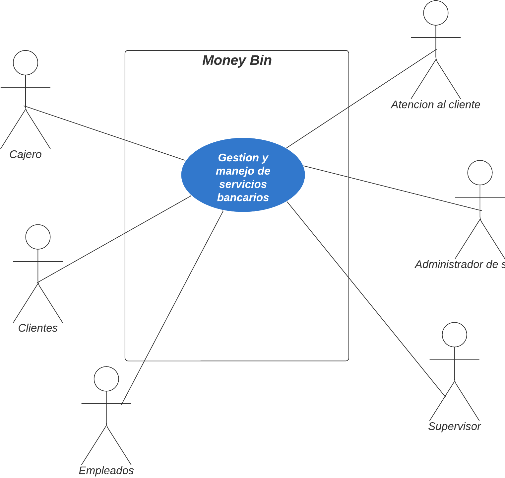
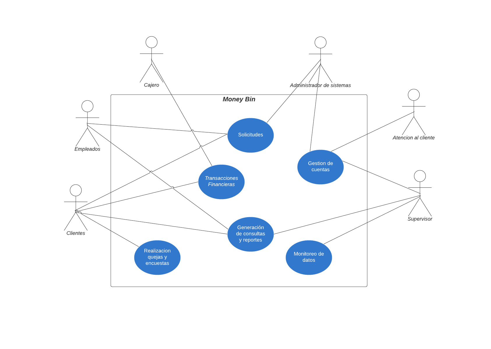
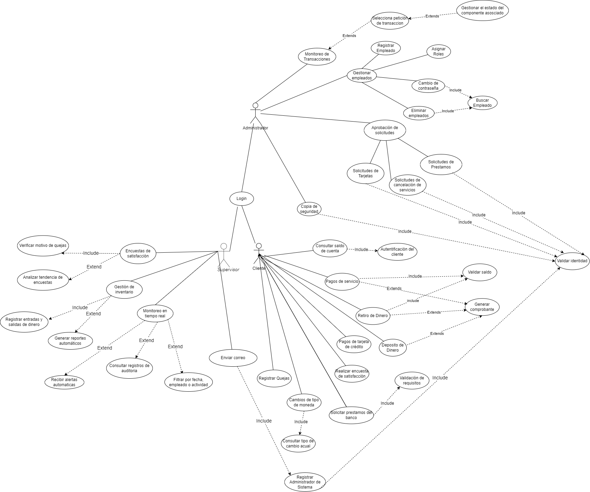
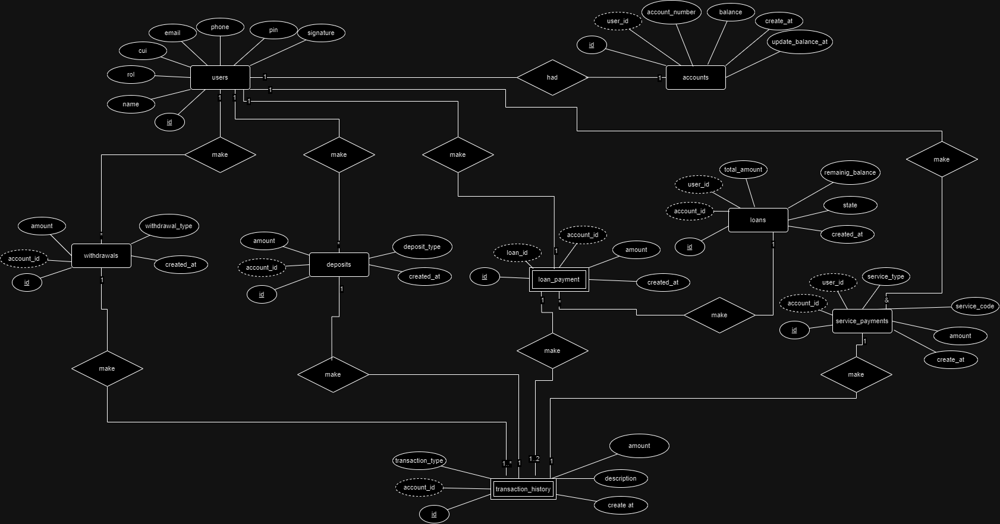

# Manual Tecnico

| Nombre                                   | Carnet     |
|------------------------------------------|------------|
| Jose Pablo Ceron Urizar                  | 201908251  |
| Luis Enrique Garcia Gutierrez            | 202010814  |
| Cristofher Antonio Saquilmer Rodas       | 201700686  |
| Mariano Francisco Camposeco Camposeco    | 202030987  |
| David Enrique Lux Barrera                | 201931344  |

## 1) Antecedentes
El Banco **"Money Bin"** enfrenta problemas como procesos lentos al momento de realizar transacciones o consultas generando largas colas en el banco, errores humanos en las transacciones, falta de accesibilidad para los clientes y sistemas manuales que limitan la capacidad de realizar pagos, manejar cuentas y generar reportes.
Además, las transacciones presenciales, la gestión basada en documentos físicos y la falta de seguridad en validaciones de identidad aumentan el riesgo de fraudes y dificultan la eficiencia operativa.

La nueva plataforma propuesta busca automatizar procesos clave, fortalecer la seguridad y transformar el modelo de operación hacia una banca virtual. Permitirá el acceso desde una aplicación web, facilitando a los usuarios gestionar sus cuentas, realizar transacciones y acceder a servicios sin la necesidad de ir al banco. También incluirá módulos intuitivos y reportes automatizados que optimicen la operación interna y el análisis del desempeño.

El objetivo es modernizar los servicios del banco, mejorar la eficiencia operativa, fortalecer la seguridad, y ofrecer una experiencia personalizada que aumente la confianza y satisfacción de los clientes, posicionando a Money Bin como un líder en innovación financiera.

## 2) Core del negocio
### Descripcion:
La actividad principal del sistema es que clientes y encargados puedan realizar diferentes transacciones y operaciones del banco desde una página web, con la finalidad de  optimizar los procesos bancarios tradicionales, resolviendo la problemática de las largas filas y no depender de procesos manuales. Para mantener y garantizar la seguridad al momento de realizar una transacción, se ha implementado la validación de identidad para minimizar el riesgo de fraude. La implementación de la plataforma también permitirá centralizar los datos y generar reportes con el fin de analizar y mejorar los aspectos no beneficiosos hacia la empresa.

Entre las transacciones disponibles que pueden realizar los clientes se incluyen pagos, retiros y depósitos. Además, para brindar un mejor control financiero, los usuarios tienen la opción de generar comprobantes como registros de sus operaciones bancarias. Para  reducir la sobrecarga de trabajo que tienen los empleados cuentan con la función de buscar cuentas de clientes por su número de cuenta o por CUI, lo que facilita la localización de información de manera precisa y rápida.

Así mismo, el sistema incluye módulos diseñados para futuras adaptaciones, algunos siendo la posibilidad de realizar cambios de divisas, gestionar préstamos, y habilitar cuentas en dólares. Ya que, estas funcionalidades aseguran que la plataforma no únicamente atienda las necesidades actuales de los clientes, sino que también esté preparada para adaptarse a futuros cambios en los sectores bancarios.

**Caso de Uso de Alto Nivel**


**Caso de Uso Primera Descomposicion**


## 3) Lista de requerimientos funcionales generales

### Requerimientos funcionales
#### **Autenticación**
- El sistema debe permitir a los clientes autenticarse mediante su **CUI** y **PIN**.
- El sistema debe ser capaz de reconocer si las credenciales ingresadas corresponden a un **cliente** o a un **empleado**.

#### **Gestión de Cuentas**
- Los empleados o encargados deben poder **consultar la información de todas las cuentas** de los clientes.
- El sistema debe mostrar el **saldo de cuenta disponible** de cada cliente.
- El administrador de sistemas podrá **proporcionar una nueva contraseña** a los empleados, cuando el supervisor lo indique.

#### **Gestión de Usuarios**
- Los empleados podrán **actualizar la información** de los clientes.
- El sistema debe permitir **agregar nuevos clientes** mediante un proceso de registro.

#### **Gestión Operativa**
- El sistema permite la búsqueda de cuentas de clientes por medio de su CUI o número de cuenta.
- El sistema permite a los clientes crear nuevas tarjetas de crédito
- El sistema permite el bloqueo y activación de tarjetas por pérdida, robo o fraude.
- El administrador de sistemas debe poder registrar y asignar roles a los empleados.

#### **Monitoreo de datos**
- El sistema permite la visualización en tiempo real de las transacciones realizadas.
- El sistema permite al supervisor generar diferentes reportes.
- El sistema permite al supervisor aceptar diferentes solicitudes.

#### **Generación de comprobantes**
- El sistema permite generar comprobantes(voucher) de las transacciones realizadas.

### Gestión de transacciones:
- El cajero deberá poder realizar pagos de servicios básicos (Agua, Luz, Teléfono e Internet)
- El sistema permitirá pagos parciales o totales de los préstamos
- El cliente deberá poder realizar depósitos y retiros, validando límites diarios y moneda
- El sistema permitirá cambiar la moneda de quetzales a dólares.


### Requerimientos no funcionales

### Seguridad:
- Encriptación de datos sensibles como contraseñas.
- El sistema contará con un modo de generar backups o respaldos de información cada cierto tiempo o cuando el administrador lo necesite.
- Rollback al detectar transacciones fallidas.

### Disponibilidad:
- El sistema debe estar disponible 24/7 para todos los usuarios.
- Debe contar con balanceadores de carga.

### **Compatibilidad:**
- Portable, ejecución adecuada en todos los  OS y navegadores.
- La interfaz del sistema debe ser responsiva en cualquier dispositivo móvil

### **Rendimiento:**
- Realizar las transacciones en un tiempo máximo de 2 segundos.
- El sistema debe ser capaz de procesar varias transacciones por segundo.

### **Usabilidad:**
- Ofrecer una experiencia intuitiva para los usuarios
- Estándares de accesibilidad
- Mostrar mensajes de error descriptivos para orientar al usuario.

### **Escalabilidad:**
- Despliegue del sistema en infraestructura en la nube.
- La arquitectura debe permitir agregar nuevas funcionalidades sin impactar negativamente el rendimiento del sistema.

### **Automatización:**
- Despliegues automatizados

## 4) Diagrama de CDU expandidos



## 5) Matrices de trazabilidad


## E. Arquitectura candidata (Diagrama de bloques)


Los clientes y encargados/empleados podran ejecutar su aplicacion de manera local en su PC con acceso a internet y este podra visualizarse en Angular, al momento de realizar las peticiones se haran por medio de un servidor API Rest alojado en Nodejs. La base de datos se encuentra alojada en un servicio RDS de AWS.

## F. Diagrama entidad relacion



## G. Endpoints
### Base URL
All endpoints share the base URL `/api`.

### 1. **Show Balance**
- **Route:** `/api/account/show-balance`
- **Method:** `GET`
- **Description:** Retrieves the account balance and the last update date.
- **Query Parameters:**
  - `cui` (string, required): Unique identifier for the user.
  - `pin` (string, required): Personal Identification Number.
- **Middleware:**
  - `validateUser('query')`
- **Response:**
  - JSON object containing account balance and the last update timestamp.

### 2. **Client Information**
- **Route:** `/api/client/get-client-info`
- **Method:** `GET`
- **Description:** Retrieves account information and transaction history.
- **Query Parameters:**
  - `cui` (string, optional): Unique identifier for the user.
  - `account_number` (string, optional): Account number.
- **Response:**
  - JSON object containing client details and transaction history.

### 3. **Service Payment**
- **Route:** `/api/payment-service`
- **Method:** `POST`
- **Description:** Processes service payments such as utility bills.
- **Request Body:**
  ```json
  {
      "service_name": "string (required)",
      "service_code": "string (required)",
      "amount": "number (required)",
      "cui": "string (required)",
      "pin": "string (required)"
  }
- **Middleware:**
  - `validateUser('body')`
- **Response:**
  - JSON object indicating the status of the payment.

### 4. **Loan Payment**
- **Route:** `/api/payloan-payment`
- **Method:** `POST`
- **Description:** Processes loan payments.
- **Request Body:**
  ```json
  {
      "loan_number": "number (required)",
      "amount": "number (required)",
      "cui": "string (required)",
      "pin": "string (required)"
  }
- **Middleware:**
  - `validateUser('body')`
- **Response:**
  - JSON object indicating the status of the loan payment.

### 5. **Deposit**
- **Route:** `/api/deposit/deposit`
- **Method:** `POST`
- **Description:** Allows depositing money via cash or transfer.
- **Request Body:**
  ```json
  {
      "account_number": "string (required)",
      "amount": "number (required)",
      "deposit_type": "string (required)",
      "target_account": "string (required)"
  }
- **Response:**
  - JSON object indicating the status of the deposit.

### 6. **Service Payment**
- **Route:** `/api/withdrawal`
- **Method:** `POST`
- **Description:** Allows withdrawing money from an account.
- **Request Body:**
  ```json
  {
      "account_number": "string (required)",
      "amount": "number (required)",
      "withdrawal_type": "string (required)"
  }
- **Response:**
  - JSON object indicating the status of the payment.

## H. Configuracion de entorno

**Requisitos Previos:**

Es necesario de asegurarnos de tener los siguientes elementos instalados y configurados:

- Node.js (versión 16.x o superior): [Descarga Nodejs](https://nodejs.org/en)
- Angular CLI (versión 15.x o superior) [Documentacion de angular](https://v17.angular.io/guide/setup-local)

- MySQL Workbench o Cliente SQL para poder interactuar con la base de datos. [Descarga MySQL Workbench](https://dev.mysql.com/downloads/workbench/)
- Git para clonar los repositorios: [Descargar Git](https://git-scm.com/)

- Instalacion de un IDE de preferencia como puede ser Visual Studio Code.


**Configuracion del Frontend(Angular)**

En la carpeta src/environments, verifica los archivos environment.ts (desarrollo) y environment.prod.ts (producción). Asegurando de incluir las URL correctas del backend, en este caso:
environment.ts:

```bash
export const environment = {
    production: false,
    apiUrl: 'http://localhost:5000/api'
};
```

**Configuracion del Backend(Nodejs)**

Una vez descargado el archivo del backend, es necesario dirigirse a la ruta donde se encuentra el package.json y poner el siguiente comando:

```bash
npm install
```

En el mismo directorio hay que crear un archivo .env que tendra las variables para conectarse con la base de datos:

```bash
MYSQL_HOST=<host-de-la-bd>
MYSQL_USER=<usuario-bd>
MYSQL_PASSWORD=<contraseña-bd>
MYSQL_DATABASE=<nombre-bd>
MYSQL_PORT=3306
PORT=<puerto-server>
```

**Inicializar la base de datos**

En En la carpeta database se encuentran los scripts necesarios para la configuración y gestión de la base de datos. Estos archivos incluyen:

- BD.sql: Contiene la estructura general para la creación inicial de la base de datos, definiendo su nombre y configuraciones principales.

- DDL.sql: Define los elementos del modelo de datos, incluyendo la creación de tablas, índices, relaciones y restricciones (definición del esquema).

- DML.sql: Contiene las instrucciones para insertar, actualizar o eliminar datos en la base de datos, estableciendo los valores iniciales requeridos para su correcto funcionamiento.

Para poder acceder a la base de datos que se encuentra en una instancia de MySQL en la nube es necesario utilizar las credenciales necesarias, por medio de linea de comando:

```bash
mysql -h <host> -P <puerto> -u <usuario> -p
```

Y por medio de MySQL Workbench es creando una base de datos desde cero e ingresar las credenciales necesarias, como Host, puerto, password etc.


## I. Instalacion y Despliegue

**Instalacion de las carpetas frontend, backend y script de la base de datos**

Una vez instalado git, es necesario clonar el repositorio donde se encuentra el proyecto:
```bash
git clone https://github.com/MarianoFrancisco/AYD2_PV_G2.git
```

**Descarga e iniciar frontend(angular)**

Una vez tengamos ya instalado Node.js y npm(se puede verificar por medio de npm -v) que son fundamentales para ejecutar angular.

Cuando descargas el proyecto Angular, lo más probable es que también descargaste el archivo package.json, que contiene las dependencias necesarias para ejecutar la aplicación. Se debe de navegar y dirigirse a la ruta donde se encuentra package.json y desde la terminal instalar las dependencias por medio de:

```bash
npm install
```

Una vez que las dependencias están instaladas, puedes ejecutar la aplicación de la siguiente manera:

```bash
ng serve
```

Una vez corriendo se puede navegar en http://localhost:4200/user/dashboard e interactuar con el proyecto.

**Descarga e iniciar backend(node.js)**

Antes de ejecutar un proyecto de Node.js, asegúrate de tener Node.js y npm instalados en tu máquina. Puedes verificar esto ejecutando los siguientes comandos en la terminal:

```bash
node -v
npm -v
```

Cuando se descarga o se clona el proyecto, se encuentra un archivo llamado package.json, que contiene todas las dependencias que el proyecto necesita. Para instalar esas dependencias:

```bash
cd ruta/del/proyecto-backend

npm install
```

Una vez que las dependencias estén instaladas y las variables de entorno configuradas, puedes iniciar el servidor de backend.

```bash
npm start
```

**Conexion a la base de datos**

Para acceder a la base de datos, ya sea mediante línea de comandos o herramientas como MySQL Workbench, es imprescindible contar con las credenciales adecuadas para establecer una conexión con la base de datos alojada en la nube de AWS.

Las credenciales necesarias vendrian siendo por ejemplo:

```bash
Connection Name: Money-bin
Hostname: example.us-east-1.rds.amazonaws.com
Username: <user-db>
Port: 3306
Password: <password-db>
```