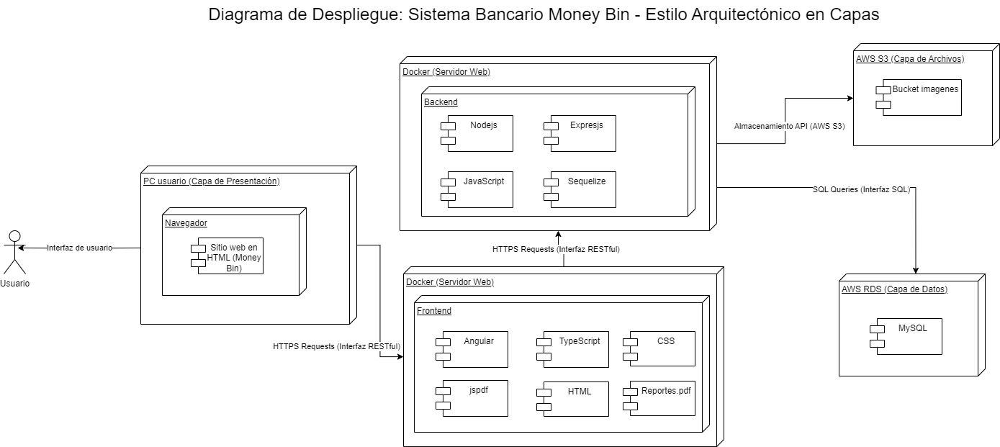
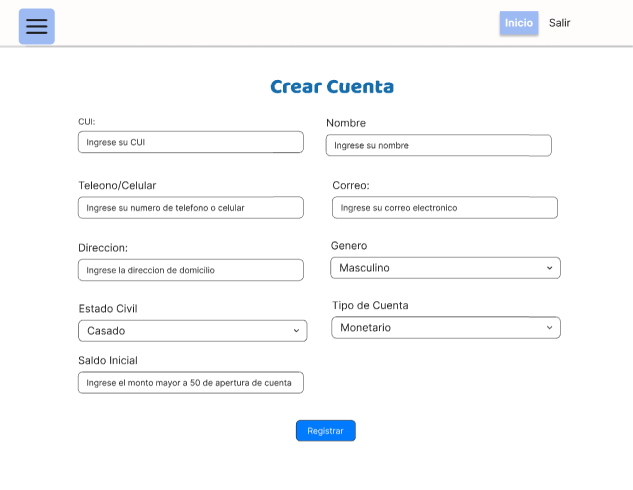
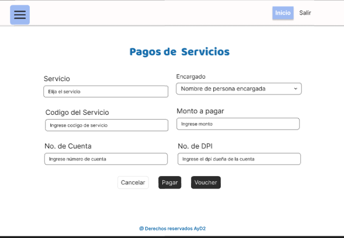
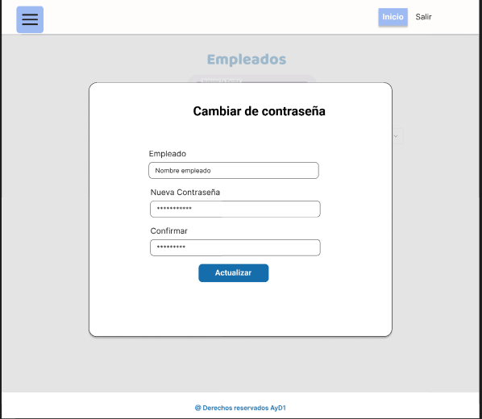
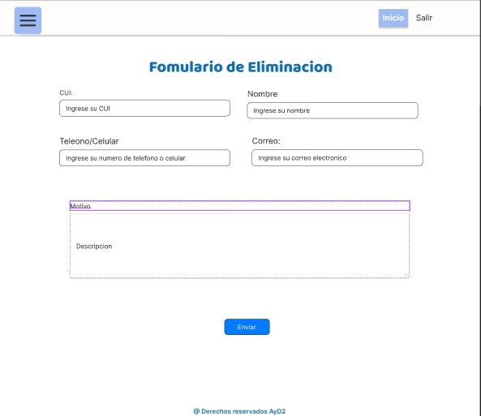
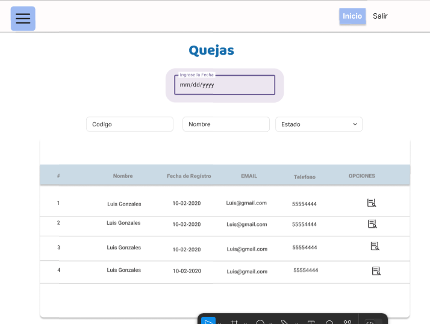

# Manual Tecnico

| Nombre                                   | Carnet     |
|------------------------------------------|------------|
| Jose Pablo Ceron Urizar                  | 201908251  |
| Luis Enrique Garcia Gutierrez            | 202010814  |
| Cristofher Antonio Saquilmer Rodas       | 201700686  |
| Mariano Francisco Camposeco Camposeco    | 202030987  |
| David Enrique Lux Barrera                | 201931344  |

## 1) Antecedentes
El Banco **"Money Bin"** enfrenta problemas como procesos lentos al momento de realizar transacciones o consultas generando largas colas en el banco, errores humanos en las transacciones, falta de accesibilidad para los clientes y sistemas manuales que limitan la capacidad de realizar pagos, manejar cuentas y generar reportes.
Además, las transacciones presenciales, la gestión basada en documentos físicos y la falta de seguridad en validaciones de identidad aumentan el riesgo de fraudes y dificultan la eficiencia operativa.

La nueva plataforma propuesta busca automatizar procesos clave, fortalecer la seguridad y transformar el modelo de operación hacia una banca virtual. Permitirá el acceso desde una aplicación web, facilitando a los usuarios gestionar sus cuentas, realizar transacciones y acceder a servicios sin la necesidad de ir al banco. También incluirá módulos intuitivos y reportes automatizados que optimicen la operación interna y el análisis del desempeño.

El objetivo es modernizar los servicios del banco, mejorar la eficiencia operativa, fortalecer la seguridad, y ofrecer una experiencia personalizada que aumente la confianza y satisfacción de los clientes, posicionando a Money Bin como un líder en innovación financiera.

## 2) Core del negocio
### Descripcion:
La actividad principal del sistema es que clientes y encargados puedan realizar diferentes transacciones y operaciones del banco desde una página web, con la finalidad de  optimizar los procesos bancarios tradicionales, resolviendo la problemática de las largas filas y no depender de procesos manuales. Para mantener y garantizar la seguridad al momento de realizar una transacción, se ha implementado la validación de identidad para minimizar el riesgo de fraude. La implementación de la plataforma también permitirá centralizar los datos y generar reportes con el fin de analizar y mejorar los aspectos no beneficiosos hacia la empresa.

Entre las transacciones disponibles que pueden realizar los clientes se incluyen pagos, retiros y depósitos. Además, para brindar un mejor control financiero, los usuarios tienen la opción de generar comprobantes como registros de sus operaciones bancarias. Para  reducir la sobrecarga de trabajo que tienen los empleados cuentan con la función de buscar cuentas de clientes por su número de cuenta o por CUI, lo que facilita la localización de información de manera precisa y rápida.

Así mismo, el sistema incluye módulos diseñados para futuras adaptaciones, algunos siendo la posibilidad de realizar cambios de divisas, gestionar préstamos, y habilitar cuentas en dólares. Ya que, estas funcionalidades aseguran que la plataforma no únicamente atienda las necesidades actuales de los clientes, sino que también esté preparada para adaptarse a futuros cambios en los sectores bancarios.

**Caso de Uso de Alto Nivel**


**Caso de Uso Primera Descomposicion**


## 3) Lista de requerimientos funcionales generales

### Requerimientos funcionales
#### **Autenticación**
- **Autenticación(RF-001):** El sistema debe permitir a los clientes autenticarse mediante su **CUI** y **PIN**.
- **Validación de roles(RF-002):** El sistema debe ser capaz de reconocer si las credenciales ingresadas corresponden a un **cliente** o a un **empleado**.

#### **Gestión de Cuentas**
- **Detalle de Cuentas(RF-003):** Los empleados o encargados deben poder **consultar la información de todas las cuentas** de los clientes.
- **Balance de Cuenta(RF-004):** El sistema debe mostrar el **saldo de cuenta disponible** de cada cliente.
- **Reestablecer contraseña(RF-005):** El administrador de sistemas podrá **proporcionar una nueva contraseña** a los empleados, cuando el supervisor lo indique.

#### **Gestión de Usuarios**
- **Editar Información(RF-006):** Los empleados podrán **actualizar la información** de los clientes.
- **Registro de Clientes(RF-007):** El sistema debe permitir **agregar nuevos clientes** mediante un proceso de registro.

#### **Gestión Operativa**
- **Busqueda de Cuenta(RF-008):** El sistema permite la búsqueda de cuentas de clientes por medio de su CUI o número de cuenta.
- **Registro de TC(RF-009):** El sistema permite a los clientes crear nuevas tarjetas de crédito
- **Estado de TC(RF-010):** El sistema permite el bloqueo y activación de tarjetas por pérdida, robo o fraude.
- **Asignación de Roles(RF-011):** El administrador de sistemas debe poder registrar y asignar roles a los empleados.

#### **Monitoreo de datos**
- **Monitoreo(RF-012):** El sistema permite la visualización en tiempo real de las transacciones realizadas.
- **Reporte de auditoria(RF-013):** El sistema permite al supervisor generar diferentes reportes.
- **Solicitudes(RF-014):** El sistema permite al supervisor aceptar diferentes solicitudes.

#### **Generación de comprobantes**
- **Generar Comprobante(RF-015):** El sistema permite generar comprobantes(voucher) de las transacciones realizadas.

### Gestión de transacciones:
- **Pago de Servicios(RF-016):** El cajero deberá poder realizar pagos de servicios básicos (Agua, Luz, Teléfono e Internet)
- **Pago de Prestamos(RF-017):** El sistema permitirá pagos parciales o totales de los préstamos
- **Transacciones(RF-018):** El cliente deberá poder realizar depósitos y retiros, validando límites diarios y moneda
- **Cambio de Divisas(RF-019):** El sistema permitirá cambiar la moneda de quetzales a dólares.


### Requerimientos no funcionales

### Seguridad:
- **Encriptación(RNF-001):** Encriptación de datos sensibles como contraseñas.
- **Backups(RNF-002):** El sistema contará con un modo de generar backups o respaldos de información cada cierto tiempo o cuando el administrador lo necesite.
- **Anti-Fallas(RNF-003):** Rollback al detectar transacciones fallidas.

### Disponibilidad:
- **Disponibilidad(RNF-004):** El sistema debe estar disponible 24/7 para todos los usuarios.
- **Redundancia(RNF-005):** Debe contar con balanceadores de carga.

### **Compatibilidad:**
- **Portable(RNF-006):** Ejecución adecuada en todos los  OS y navegadores.
- **Adaptabilidad(RNF-007):** La interfaz del sistema debe ser responsiva en cualquier dispositivo móvil

### **Rendimiento:**
- **Latencia(RNF-008:** Realizar las transacciones en un tiempo máximo de 2 segundos.
- **Concurrencia(RNF-009):** El sistema debe ser capaz de procesar varias transacciones por segundo.

### **Usabilidad:**
- **Interfaz Gráfica(RNF-010):** Ofrecer una experiencia intuitiva para los usuarios
- **Intuición Gráfica(RNF-011):** Estándares de accesibilidad
- **Alertas(RNF-012):** Mostrar mensajes de error descriptivos para orientar al usuario.
- **Reportes(RNF-013):** Generar reportes automáticos y personalizados.

### **Escalabilidad:**
- **Infraestructura(RNF-014):** Despliegue del sistema en infraestructura en la nube.
- **Arquitectura(RNF-015):** La arquitectura debe permitir agregar nuevas funcionalidades sin impactar negativamente el rendimiento del sistema.

### **Automatización:**
- **CI/CD(RNF-016):** Despliegues automatizados

## 4) Diagrama de CDU expandidos


## 5) Casos de Uso expandidos


**Caso de uso:** Pago servicios <br>
**Actores:** Cliente, Cajero<br>
***Descripcion: Este modulo permite a los clientes y cajeros realizar pagos de diferentes servicios como luz, internet, agua y telefono.***<br>
***Curso normal de los eventos:*** <br>
1. Primero el cliente y el cajero deberan iniciar sesion. <br>
2. El cliente y el cajero deberan validar su identidad para evitar cualquier fraude. <br>
3. El cliente y el cajero pueden elegir el servicio que desean pagar <br>
4. Luego de realizar el pago el sistema le generar un comprobante con los detalles del pago <br>

***Cursos alternos:*** <br>
2. En caso de que no se valide correctamente la identidad del cajero o cliente no se procedera a realizar el pago. <br>

--------------------------------------------------------

**Caso de uso:** Validar identidad <br>
**Actores:** Cliente, Cajero, Supervisor, Administrador de sistemas<br>
***Descripcion:*** Este modulo permite a los clientes y cajeros realizar pagos de diferentes servicios como luz, internet, agua y telefono.<br>
***Curso normal de los eventos:*** <br>
1. Primero el cliente y el cajero deberan iniciar sesion. <br>
2. El cliente y el cajero deberan validar su identidad para evitar cualquier fraude. <br>
3. El cliente y el cajero pueden elegir el servicio que desean pagar <br>
4. Luego de realizar el pago el sistema le generar un comprobante con los detalles del pago <br>

------------------------------------------

**Caso de uso:** Aprobacion de solicitudes <br>
**Actores:** Administrador de sistemas<br>
**Descripcion:** Este modulo permite a los administradores aprobar solicitudes de prestamos, solicitudes de tarjetas y solicitudes de cancelacion de servicios.<br>
**Curso normal de los eventos:** <br>
1. Primero el administrador de sistemas debera iniciar sesion <br>
2. El administrador de sistemas debera validar su identidad para evitar cualquier fraude. <br>
3. El administrador revisara las solicitudes, podra ver cualquier papeleria que haya sido enviada, informacion de los clientes como saldos pendientes. <br>
4. El administrador podra aceptar la solicitud recibida. <br> 
***Cursos alternos:*** <br>
2) En caso de que el papeleo este incorrecto o haya algun saldo pendient el administrador rechazara la solicitud enviada. <br>
-------------------------------------

**Caso de uso:** Monitoreo en tiempo real<br>
**Actores:** Supervisor<br>
**Descripcion:** Este modulo permite a los supervisores monitorear datos de inventario y actividades que realicen los administradores y empleados<br>
**Curso normal de los eventos:** <br>
1. Primero el supervisor debera iniciar sesion para acceder a este modulo.<br>
2. El administrador podra recibir alertas automaticas de las actividades de los empleados y administradores<br>
3. El supervisor podra filtrar por fecha, empleado o actividad para buscar mas facilmente la informacion a monitorear <br>


## 6) Matrices de trazabilidad

### Stakeholder vrs Requerimientos


### Stakeholders vrs CDU


### Requerimiento vrs CDU


## 7) Selección del o los Estilos Arquitectónicos

El banco **Money Bin** requiere un diseño arquitectónico que cumpla o se alinee con las metas del banco, como son la seguridad, rendimiento, modernidad, etc. Para ello, se optó por un estilo arquitectónico basado en **capas**.

Este enfoque organiza la plataforma en varias capas, cada una con responsabilidades diferentes:

### 1. Capa de Presentación
Se encarga de las interfaces de usuario, asegurando que cada tipo de usuario (clientes, cajeros, administradores, supervisores, etc.) pueda interactuar de forma eficiente y segura con el sistema.

### 2. Capa de Lógica de Negocio
Contiene las reglas y procesos principales del sistema, como:
- Autenticación.
- Procesamiento de pagos y transferencias.
- Gestión de empleados.
- Generación de comprobantes.
- Validación de identidad.

Esta capa centraliza la lógica del negocio para garantizar que las operaciones sean consistentes y seguras.

### 3. Capa de Lógica de Datos
Maneja la interacción con la base de datos, incluyendo:
- Gestión de cuentas.
- Transacciones.
- Préstamos.
- Roles de los usuarios.

Esta capa garantiza que los datos estén organizados y disponibles para las demás capas de forma eficiente.

### Capa de infraestructura
Proporciona el soporte necesario para ejecutar las aplicaciones.

## Beneficios de la Arquitectura en Capas

La arquitectura en capas ofrece una estructura clara y bien definida que facilita: 
- **Mantenimiento.**
- **Escalabilidad.**
- **Comprension del sistema.**

Al separar las responsabilidades en capas especificas, se mejora la modularidad y se reduce el impacto de los cambios en una parte del sistema. 
### Arquitectura candidata (Diagrama de bloques)


Los clientes y encargados/empleados podran ejecutar su aplicacion de manera local en su PC con acceso a internet y este podra visualizarse en Angular, al momento de realizar las peticiones se haran por medio de un servidor API Rest alojado en Nodejs. La base de datos se encuentra alojada en un servicio RDS de AWS.

## 8) Diagrama de despliegue y componentes




## 9) Diagrama entidad relacion


**Link:**  [Link](https://drive.google.com/file/d/1K6XSIMpArZHsAqhgD7s1YcEdYW7MxlCb/view?usp=sharing)

## 9) Prototipos

### Login


### Responsive Inicio


### Cajero-inicio


### Cajero-Busqueda de Cuenta


### Cajero-Cambio de Moneda


### Cajero-Depositos


### Cajero-Pagos de Prestamos


### Cajero-Pagos de Servicios


### Cajero-Pago de Tarjeta


### Cajero-Retiros


### Atencion-Inicio


### Atencion-ActualizarDatos


### Atencion-BloquearTarjeta


### Atencion-BloquearTarjeta2


### Atencion-CrearCuenta



### Atencion-CrearTarjeta


### Atencion-CrearTarjeta2


### Cliente-Inicio


### Cliente-Encuesta


### Cliente-Queja


### Cliente-Pago de Servicios



### Admin-inicio


### Admin-Registrar Empleado


### Admin-Empleados


### Admin-Asignar Roles


### Admin-Cambiar Contraseña



### Admin-Copia de seguridad


### Admin-Eliminar empleados




### Supervisor-Inicio


### Supervisor-AprobarTarjetas


### Supervisor-AprobarTarjetas2


### Supervisor-Encuesta


### Supervisor-Encuesta2


### Supervisor-RegistrarAdmin


### Supervisor-Servicios


### Supervisor-Servicios2


### Supervisor-SolicitudPrestamos


### Supervisor-SolicitudPrestamos2


### EdicionPerfil


### Supervizor-Admins


### Supervizor-Admin2


### Supervizor-Admin3


### Supervizor-Gestion


### Supervizor-Monitoreo


### Supervizor-Queja



### Supervizor-Queja2


### SupervizorReportes


## 10) Patrones de diseño

### 1. Patrón Singleton

#### Diagrama UML


#### Descripción
Este patrón se encarga de crear una única instancia para controlar el acceso de las clases y mantener consistencia en los datos. También controla el acceso a recursos compartidos.

#### ¿Por qué?
La aplicación maneja monitoreo en tiempo real, gestión de inventario y copias de seguridad. Estas copias generan datos que necesitan ser gestionados de manera centralizada.  
Con este patrón aseguramos que una única instancia controle la gestión del inventario, monitoreo de actividades o la gestión de copias de seguridad, evitando la duplicación de datos.

### 2. Patrón State

#### Diagrama UML


#### Descripción
Este patrón se basa en los diferentes estados que puede tener un objeto y cómo en cada estado su comportamiento será diferente. Pueden existir cambios finitos entre estados, lo cual se denomina transición.

#### ¿Por qué?
Al momento de realizar una solicitud para cancelar un servicio, esta pasará por diferentes estados:  
1. **EnviarSolicitud**: Aquí la solicitud será revisada antes de enviarla al supervisor.  
2. **ProcesarSolicitud**: En este estado, el supervisor verificará que no existan pagos pendientes en el servicio antes de aceptar o rechazar la solicitud.

### 3. Patrón Strategy

#### Diagrama UML


#### Descripción
Este patrón permite diseñar diferentes algoritmos y tenerlos en una clase diferente, esto para no tener todo en una sola clase y evitar un conflicto si un algoritmo debe ser cambiado.

#### ¿Por qué?
La aplicación maneja diferentes pagos, como pago de servicios, pago de préstamos o pago de tarjetas. Cada uno tiene su algoritmo diferente pero con la misma finalidad de procesar un pago, por lo que es necesario manejar cada tipo de pago en una clase diferente para ayudar a mantener un código limpio y legible.


### 4. Patrón Observer 
 
#### Diagrama UML 

 
#### Descripción 
Este patrón se basa en dependencias de uno a muchos entre objetos, lo que significa que cuando un objeto relacionado cambia, se detona una notificación a los objetos interesados. 
 
#### ¿Por qué? 
Es necesario notificar al cliente cuando el bloqueo de tarjeta se haya realizado, por lo que este patrón facilita la implementación de notificaciones (envío de correo) en tiempo real.

### 5. Patrón Command

#### Diagrama UML


#### Descripción
Este patrón se basa en la creación de objetos por solicitud, lo que permite el manejo de colas, ya sea para aceptar o rechazar la solicitud.

#### ¿Por qué?
El supervisor puede aceptar y/o rechazar solicitudes de préstamos o tarjetas. Este patrón facilita el manejo de estas solicitudes generando una cola para llevar un orden en su procesamiento.


## H. Configuracion de entorno

**Requisitos Previos:**

Es necesario de asegurarnos de tener los siguientes elementos instalados y configurados:

- Node.js (versión 16.x o superior): [Descarga Nodejs](https://nodejs.org/en)
- Angular CLI (versión 15.x o superior) [Documentacion de angular](https://v17.angular.io/guide/setup-local)

- MySQL Workbench o Cliente SQL para poder interactuar con la base de datos. [Descarga MySQL Workbench](https://dev.mysql.com/downloads/workbench/)
- Git para clonar los repositorios: [Descargar Git](https://git-scm.com/)

- Instalacion de un IDE de preferencia como puede ser Visual Studio Code.


**Configuracion del Frontend(Angular)**

En la carpeta src/environments, verifica los archivos environment.ts (desarrollo) y environment.prod.ts (producción). Asegurando de incluir las URL correctas del backend, en este caso:
environment.ts:

```bash
export const environment = {
    production: false,
    apiUrl: 'http://localhost:5000/api'
};
```

**Configuracion del Backend(Nodejs)**

Una vez descargado el archivo del backend, es necesario dirigirse a la ruta donde se encuentra el package.json y poner el siguiente comando:

```bash
npm install
```

En el mismo directorio hay que crear un archivo .env que tendra las variables para conectarse con la base de datos:

```bash
MYSQL_HOST=<host-de-la-bd>
MYSQL_USER=<usuario-bd>
MYSQL_PASSWORD=<contraseña-bd>
MYSQL_DATABASE=<nombre-bd>
MYSQL_PORT=3306
PORT=<puerto-server>
```

**Inicializar la base de datos**

En En la carpeta database se encuentran los scripts necesarios para la configuración y gestión de la base de datos. Estos archivos incluyen:

- BD.sql: Contiene la estructura general para la creación inicial de la base de datos, definiendo su nombre y configuraciones principales.

- DDL.sql: Define los elementos del modelo de datos, incluyendo la creación de tablas, índices, relaciones y restricciones (definición del esquema).

- DML.sql: Contiene las instrucciones para insertar, actualizar o eliminar datos en la base de datos, estableciendo los valores iniciales requeridos para su correcto funcionamiento.

Para poder acceder a la base de datos que se encuentra en una instancia de MySQL en la nube es necesario utilizar las credenciales necesarias, por medio de linea de comando:

```bash
mysql -h <host> -P <puerto> -u <usuario> -p
```

Y por medio de MySQL Workbench es creando una base de datos desde cero e ingresar las credenciales necesarias, como Host, puerto, password etc.


## I. Instalacion y Despliegue

**Instalacion de las carpetas frontend, backend y script de la base de datos**

Una vez instalado git, es necesario clonar el repositorio donde se encuentra el proyecto:
```bash
git clone https://github.com/MarianoFrancisco/AYD2_PV_G2.git
```

**Descarga e iniciar frontend(angular)**

Una vez tengamos ya instalado Node.js y npm(se puede verificar por medio de npm -v) que son fundamentales para ejecutar angular.

Cuando descargas el proyecto Angular, lo más probable es que también descargaste el archivo package.json, que contiene las dependencias necesarias para ejecutar la aplicación. Se debe de navegar y dirigirse a la ruta donde se encuentra package.json y desde la terminal instalar las dependencias por medio de:

```bash
npm install
```

Una vez que las dependencias están instaladas, puedes ejecutar la aplicación de la siguiente manera:

```bash
ng serve
```

Una vez corriendo se puede navegar en http://localhost:4200/user/dashboard e interactuar con el proyecto.

**Descarga e iniciar backend(node.js)**

Antes de ejecutar un proyecto de Node.js, asegúrate de tener Node.js y npm instalados en tu máquina. Puedes verificar esto ejecutando los siguientes comandos en la terminal:

```bash
node -v
npm -v
```

Cuando se descarga o se clona el proyecto, se encuentra un archivo llamado package.json, que contiene todas las dependencias que el proyecto necesita. Para instalar esas dependencias:

```bash
cd ruta/del/proyecto-backend

npm install
```

Una vez que las dependencias estén instaladas y las variables de entorno configuradas, puedes iniciar el servidor de backend.

```bash
npm start
```

**Conexion a la base de datos**

Para acceder a la base de datos, ya sea mediante línea de comandos o herramientas como MySQL Workbench, es imprescindible contar con las credenciales adecuadas para establecer una conexión con la base de datos alojada en la nube de AWS.

Las credenciales necesarias vendrian siendo por ejemplo:

```bash
Connection Name: Money-bin
Hostname: example.us-east-1.rds.amazonaws.com
Username: <user-db>
Port: 3306
Password: <password-db>
```