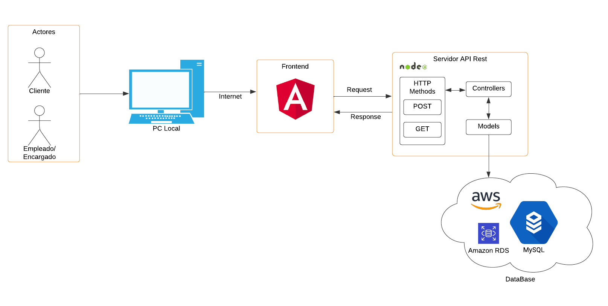

# Manual Tecnico

| Nombre                                   | Carnet     |
|------------------------------------------|------------|
| Jose Pablo Ceron Urizar                  | 201908251  |
| Luis Enrique Garcia Gutierrez            | 202010814  |
| Cristofher Antonio Saquilmer Rodas       | 201700686  |
| Mariano Francisco Camposeco Camposeco    | 202030987  |
| David Enrique Lux Barrera                | 201931344  |


## A. Core del negocio


La actividad principal del sistema es que clientes y encargados puedan realizar diferentes transacciones y operaciones del banco desde una aplicacion web, con la finalidad de resolver el problema de largas filas y reducir la carga para los empleados. Para seguir manteniendo su trayectoria con la seguridad se ha implementado una funcion de validacion de identidad al momento de realizar una transaccion para evitar cualquier fraude. Entre las transacciones que pueden realizar los clientes son pagos, retiros y depositos, ademas para que los clientes tengan un registro de sus operaciones bancarias podra generar un comprobante. Para reducir la carga de los empleados cuentan con la funcion de buscar cuentas de clientes por su numero de cuenta o por CUI y asi poder localizarlas rapidamente.

## B. Requerimientos funcionales

1. El cliente o encargado deberá tener la posibilidad de consultar el saldo en su cuenta.

2. El sistema deberá contar con una opción de generar comprobante en formato PDF luego de realizar una transaccion.

3. El empleado deberá tener la opción de buscar una cuenta por su número de cuenta o CUI para poder visualizar su perfil

4. Cada deposito que el cliente realice pordrá hacerlo por transferencia o por efectivo.

5. El cliente deberá tener la posibliidad de realizar un retiro de dinero de su cuenta por ventanilla o por cajero automatico.

6. Cada pago de préstamo adquirido con el banco que realice el cliente deberá pdoer hacerlo parcial o completamente.

7. El encargado deberá tener la posiblidad de realizar el pago de un servicio desde el sistema del banco.

8. El sistema contara con un proceso de validacion de identidad al momento de realizar una transaccion.

## C. Requerimientos no funcionales

1. Los comprobantes generados se realizaran en un maximo de 1 segundo.

2. Cada transaccion que se realice deberá procesarse en un maximo de 2 segundos.

3. La interfaz de usuario deberá ser intuitiva y facil de utilizar para los clientes.

4. Los usuarios dispondrán de un pin para garantizar mayor seguridad y privacidad en sus cuentas.

5. El sitema deberá contar con autenticación y autorización para evitar fraudes al momento de realizar una transacción.

6. La aplicacion deberá tener la posiblidad de ser ejecutado en cualquier navegador.

7. El sistema deberá ser escalable para manejar un gran número de usuarios.

## D. CDU expandidos

***Caso de uso:*** Depositar dinero <br>
***Actores:*** Cliente <br>
***Proposito:*** Depositar una cantidad de dinero en una cuenta. <br>
***Tipo:*** Primario <br>
***Descripcion:*** El cliente puede realizar un deposito por medio de efectivo o por medio de transferencia. Cuando se realice por efectivo el empleado será encargado de pasar el dinero a la cuenta y cuando se realice por transferencia el mismo cliente podra realizar el depósito. <br>
***Curso normal de los eventos:*** <br>
1. El sistema pedira realizar una validacion del cliente para evitar fraudes.
2. El sistema buscara que la informacion del cliente sea correcta.
3. El cliente ingresara la siguiente informacion: Numero de cuenta, monto a depositar, fecha y hora del deposito, metodo de deposito.
4. El sistema validara que la cuenta de origen tenga los fondos suficientes para realizar el deposito. 
5. El sitema realizara el deposito y actualizara el saldo de la cuenta.
6. El cliente podrá generar el comprobante en formato PDF.<br>

***Cursos alternos:*** <br>
***Linea 3:*** En caso de que el sistema no valide correctamente la informacion del cliente no se procedera a solicitar la informacion para realizar el deposito. <br>
***Linea 5:*** El sistema no podra realizar el deposito por falta de fondos y se le notificara al cliente.

------------------------------------------

***Caso de uso:*** Pagar prestamos <br>
***Actores:*** Cliente <br>
***Proposito:*** Pagar los prestamos adquiridos con el banco Money Bin. <br>
***Tipo:*** Primario <br>
***Descripcion:*** El cliente puede realizar el pago de sus prestamos de manera parcial o total. <br>
***Curso normal de los eventos:*** <br>
1. El sistema pedira realizar una validacion del cliente para evitar cualquier fraude.
2. El sitema buscara que la informacion del cliente sea correcta.
3. El cliente ingresara la siguiente informacion: Numero de cuenta del cliente, numero de prestamo, monto a pagar.
4. El sistema efectuara el pago y notificara que el pago del prestamo se realizo de manera correcta.
5. El cliente podrá generar el comprobante en formato PDF.<br>

***Cursos alternos:*** <br>
***Linea 3:*** En caso de que el sistema no valide correctamente la informacion del cliente no se procedera a solicitar la informacion para ralizar el pago del prestamo.

------------------------------------------

***Caso de uso:*** Pagar servicios <br>
***Actores:*** Encargado/Empleado <br>
***Proposito:*** Pagar los servicios basicos. <br>
***Descripcion:*** El encargado podra realizar pagos de los servicios basicos en nombre de los clientes desde el sistema. Los servicios basicos son agua, luz, telefono e internet.<br>
***Curso normal de los eventos:*** <br>
1. El sistema pedira realizar una validacion del encargado donde ingrese el cui y pin para confirmar que el cliente exista en el sistema.
2. El sistema buscara que la informacion sea correcta.
3. El encargado debera ingresar la siguiente informacion: Nombre de la persona encargada del servicio, codigo de servicio y monto que debe pagar.
4. El sistema realizara el pago del servicio.
5. El encargado/empleado podra generar un comprobante del pago.<br>

***Cursos alternos:*** <br>
***Linea 3:*** En caso de que el sistema no valide correctamente la informacion del cliente no se procedera a solicitar la informacion para el pago del servicio y se le notificara al encargado/empleado.

------------------------------------------

***Caso de uso:*** Retirar dinero <br>
***Actores:*** cliente <br>
***Proposito:*** Retirar dinero de su cuenta. <br>
***Descripcion:*** El cliente podra realizar un retiro de efectivo desde su cuenta por ventanilla o en cajero automatico.<br>
***Curso normal de los eventos:*** <br>
1. El sistema pedira realizar una validacion del cliente para evitar algun fraude.
2. El sistema buscara que la informacion del cliente sea valida.
3. El cliente debera ingresar la siguiente informacion: Numero de cuenta del cliente, monto a retirar y tipo de retiro

4. El sistema buscara que el cliente tenga los fondos suficinetes para realizar el retiro.
5. El sistema realizara el retiro del efectivo.
6. El encargado/empleado podra generar un comprobante del pago.<br>

***Cursos alternos:*** <br>
***Linea 3:*** En caso de que el sistema no valide correctamente la informacion ingresada del cliente no se procedera a realizar el pago del servicio y se le notificara al encargado/empleado.
***Linea 5:*** El sistema no realizara el retiro del efectivo en caso de no tener el saldo suficinete al solicitado y se le notificara al cliente. <br>
***Linea 5:*** El empleado sera quien realice el retiro si el cliente decidio hacer su retiro por ventanilla.

## E. Arquitectura candidata (Diagrama de bloques)



Los clientes y encargados/empleados podran ejecutar su aplicacion de manera local en su PC con acceso a internet y este podra visualizarse en Angular, al momento de realizar las peticiones se haran por medio de un servidor API Rest alojado en Nodejs. La base de datos se encuentra alojada en un servicio RDS de AWS.

## F. Diagrama entidad relacion


## Endpoints
### Base URL
All endpoints share the base URL `/api`.

### 1. **Show Balance**
- **Route:** `/api/account/show-balance`
- **Method:** `GET`
- **Description:** Retrieves the account balance and the last update date.
- **Query Parameters:**
  - `cui` (string, required): Unique identifier for the user.
  - `pin` (string, required): Personal Identification Number.
- **Middleware:**
  - `validateUser('query')`
- **Response:**
  - JSON object containing account balance and the last update timestamp.

### 2. **Client Information**
- **Route:** `/api/client/get-client-info`
- **Method:** `GET`
- **Description:** Retrieves account information and transaction history.
- **Query Parameters:**
  - `cui` (string, optional): Unique identifier for the user.
  - `account_number` (string, optional): Account number.
- **Response:**
  - JSON object containing client details and transaction history.

### 3. **Service Payment**
- **Route:** `/api/payment-service`
- **Method:** `POST`
- **Description:** Processes service payments such as utility bills.
- **Request Body:**
  ```json
  {
      "service_name": "string (required)",
      "service_code": "string (required)",
      "amount": "number (required)",
      "cui": "string (required)",
      "pin": "string (required)"
  }
- **Middleware:**
  - `validateUser('body')`
- **Response:**
  - JSON object indicating the status of the payment.

### 4. **Loan Payment**
- **Route:** `/api/payloan-payment`
- **Method:** `POST`
- **Description:** Processes loan payments.
- **Request Body:**
  ```json
  {
      "loan_number": "number (required)",
      "amount": "number (required)",
      "cui": "string (required)",
      "pin": "string (required)"
  }
- **Middleware:**
  - `validateUser('body')`
- **Response:**
  - JSON object indicating the status of the loan payment.

### 5. **Deposit**
- **Route:** `/api/deposit/deposit`
- **Method:** `POST`
- **Description:** Allows depositing money via cash or transfer.
- **Request Body:**
  ```json
  {
      "account_number": "string (required)",
      "amount": "number (required)",
      "deposit_type": "string (required)",
      "target_account": "string (required)"
  }
- **Response:**
  - JSON object indicating the status of the deposit.

### 6. **Service Payment**
- **Route:** `/api/withdrawal`
- **Method:** `POST`
- **Description:** Allows withdrawing money from an account.
- **Request Body:**
  ```json
  {
      "account_number": "string (required)",
      "amount": "number (required)",
      "withdrawal_type": "string (required)"
  }
- **Response:**
  - JSON object indicating the status of the payment.

