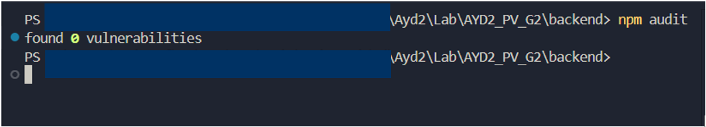
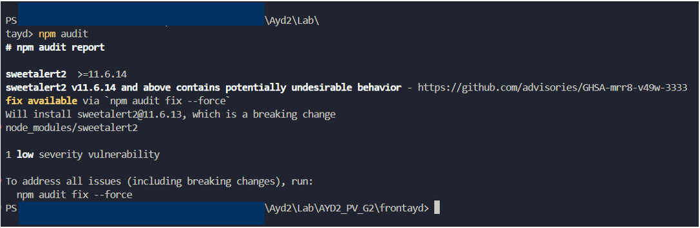
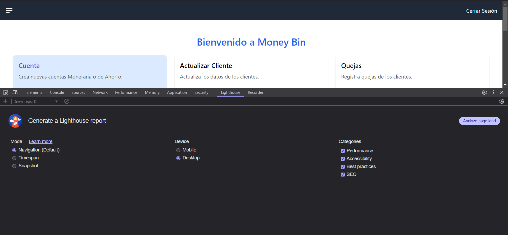
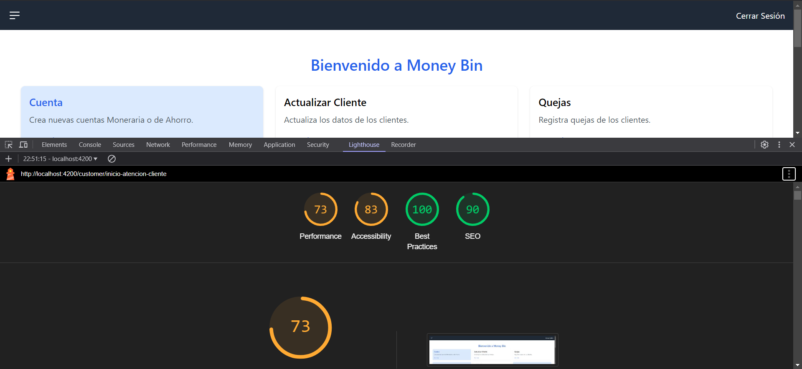
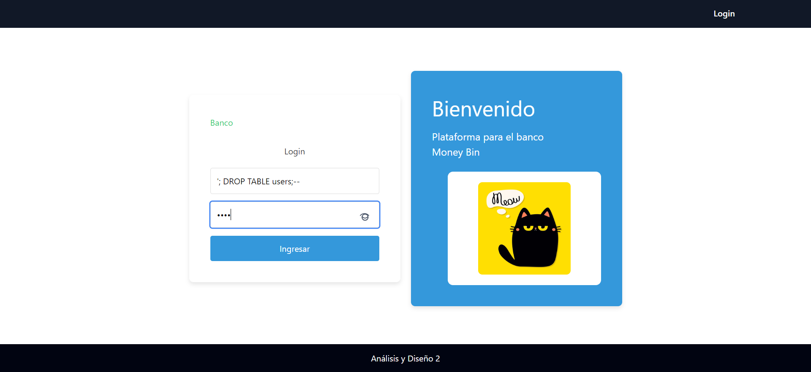
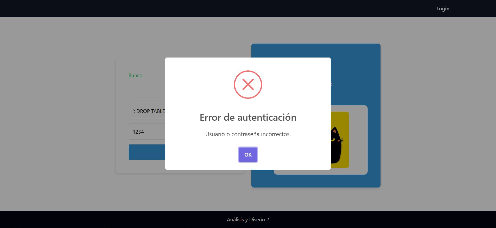
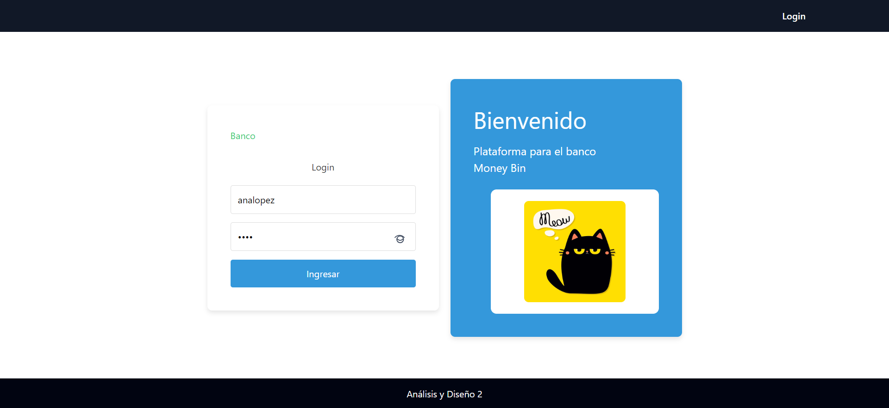
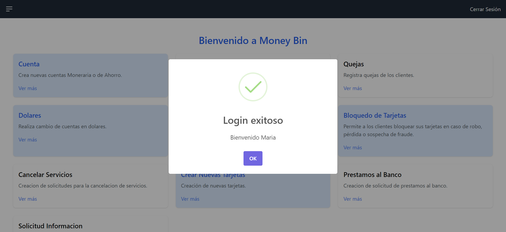
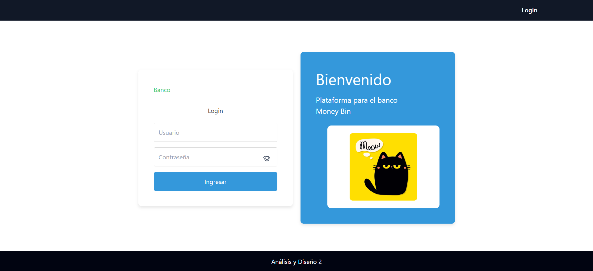
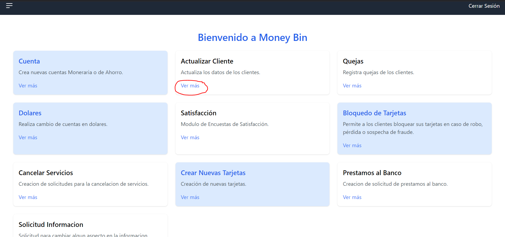

# Pruebas No Funcionales

## Pruebas de Seguridad
### npm audit
Para detectar vulnerabilidades en las dependencias de Node.js.
- Backend:

- Frontend:

## Pruebas de Rendimiento
### Lighthouse 
Para Medir la capacidad de la aplicación bajo diferentes niveles de carga.

- Configuración Inicial: prueba de rendimiento a la url http://localhost:4200/customer/inicio-atencion-cliente

- Resultado: analizis finalizdo

## Pruebas de inyección SQL
### Pruebas Manuales
Detectar si la aplicación es vulnerable a inyecciones SQL.

- Envío: Colocando la sentencia '; DROP TABLE users;-- en el campo del usuario para intentar borrar la tabla users

- Respuesta: Posteriormente de envíar la sentencia mencionada anteriormente

#### Validando prueba inyección SQL
Se valida que la prueba de inyección SQL realizada anteriormente no se haya ejecutado.

- Login: Se colocan credenciales de un usuario existente en la db.

- Ingreso: se ingresa exitosamente.

## Pruebas de Usabilidad
### Inspección Cognitiva
Simular cómo un usuario puede aprender y usar la aplicación.

- Definir tareas comunes (iniciar sesión, ingrear a un modulo).
- Iniciar Sesión: colocar credenciales y dar clic en ingresar

- Ingresar a un Modulo:

- Paso a paso, analizar si cada interacción requiere esfuerzo cognitivo innecesario:

- ¿Es claro qué acción debe realizarse a continuación?
R// Si es claro que es lo que se debe de realizar a continuación, luego de iniciar sesión, adicional cada funcionalidad y/o modulo tiene una breve descripción.

- ¿Los elementos clave son visibles y comprensibles?
R// Los elementos clave son visibles al usuario, quizá no 100% comprensibles ya que el boton para ingresar a la funcionalidad y/o modulo dice "ver más" en lugar de "ingresar" o alguna otra acción de mayor entendimiento.